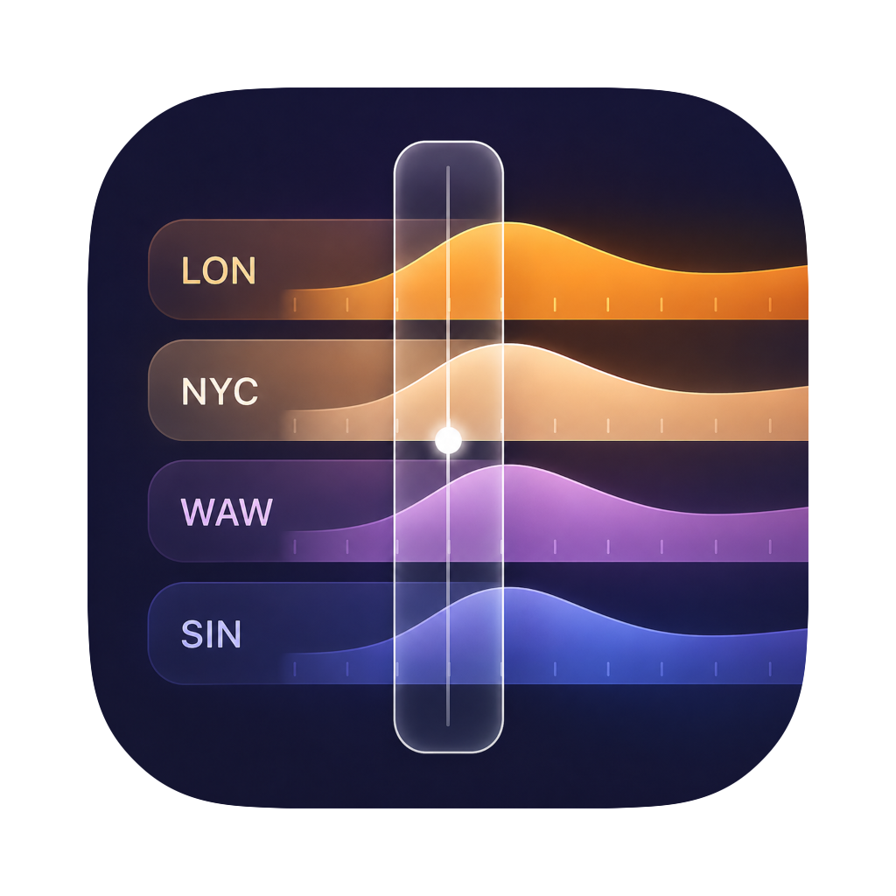
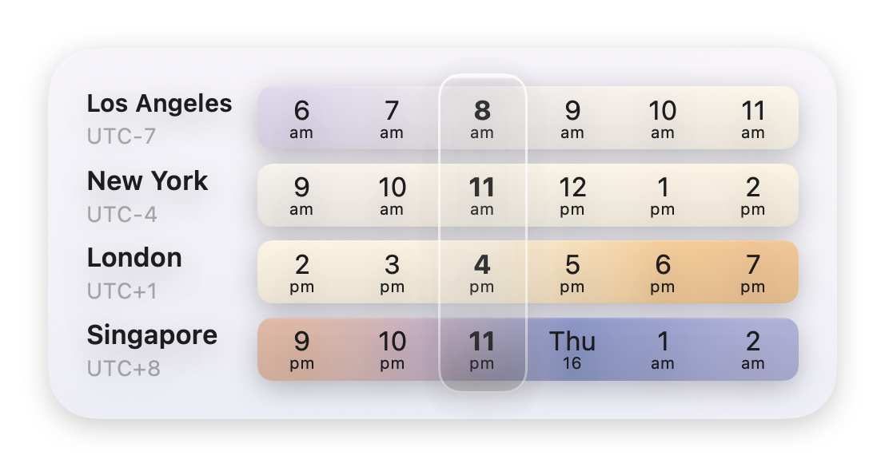
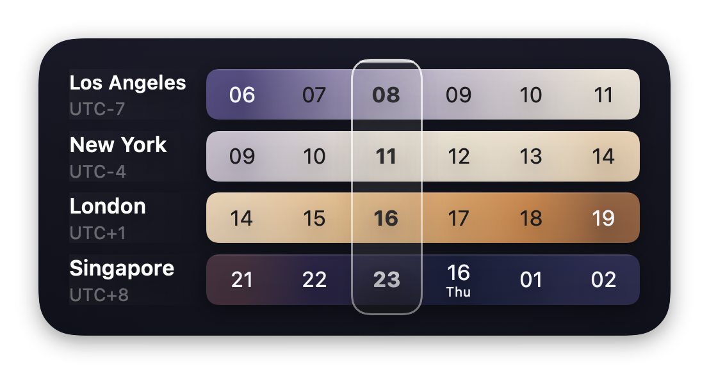

<p align="center">
  
</p>

<h1 align="center">Time Strip</h1>

<p align="center">
  A macOS widget that lines several time zones up on one grid, so a single
  marker reads the same instant in every city. Native macOS, no third-party
  dependencies.
</p>

<p align="center">
  <a href="https://github.com/lysyi3m/time-strip/actions/workflows/ci.yml">
    
  </a>
</p>

<p align="center">
  
  
</p>

## Download

Download the latest `.dmg` from the
[**Releases**](https://github.com/lysyi3m/time-strip/releases/latest) page and
drag **Time Strip** into Applications.

> **Note:** the app is not yet notarized, and macOS only registers a widget from
> a notarized app — so a downloaded build's widget may not appear in **Edit
> Widgets**. Until then, **build it yourself** (below).

## Features

- **Two to seven time zones**, each a horizontal day/night-shaded ribbon.
- **Absolute-time alignment** — every column is one instant, so *now* is a single vertical line across every city.
- **Medium and Large** sizes — up to four cities on Medium, seven on Large.
- **Configure on the widget** — right-click ▸ *Edit Widget* to choose cities and drag to reorder.
- **12- or 24-hour** clock, following your system setting.
- **Light and dark**, with continuous time-of-day shading and the current hour marked.

## Requirements

- macOS 15 (Sequoia) or later
- Xcode 16+ and `xcodegen` (to build)

## Build & run

```bash
brew install xcodegen         # one-time
make generate                 # regenerate "Time Strip.xcodeproj" from project.yml
open "Time Strip.xcodeproj"   # select a signing team, then press ⌘R
```

To install the widget without Xcode, set your signing team in `project.yml` and
run `make install` (builds signed, copies to `/Applications`, and registers the
widget). Run `make` to list all tasks (`generate`, `test`, `build`, `install`,
`dmg`, `clean`).

The Xcode project is generated from [`project.yml`](project.yml) — it is
gitignored and must not be hand-edited.

## How it works

Every column across all rows is one shared UTC instant, stepped by a fixed
3600 s rather than "add one clock hour" — so *now* stays a single straight line
and DST changes or sub-hour zones (e.g. UTC+5:30) never skew the grid. That grid
math, the locale-aware 12/24-hour formatting, and the OS-sourced zone catalog
live in the UI-free, unit-tested `TimeStripKit` framework. The SwiftUI ribbon is
fully responsive, filling whatever bounds each widget family provides.

## Project structure

| Path | Purpose |
| --- | --- |
| `Sources/Kit/` | `TimeStripKit` — UI-free core: time engine, formatter, zone catalog, models |
| `Sources/UI/` | `TimeStripUI` — SwiftUI ribbon view, palette, widget background |
| `Sources/Widget/` | WidgetKit extension: timeline provider + `AppIntent` configuration |
| `Sources/App/` | Minimal host app (onboarding window) |
| `Tests/` | Unit tests (`@testable import TimeStripKit` / `TimeStripUI`) |

## Testing

No setup required — the tests build their own fixtures and pull zones from the OS:

```bash
make test
```

## License

MIT — see [LICENSE](LICENSE).
